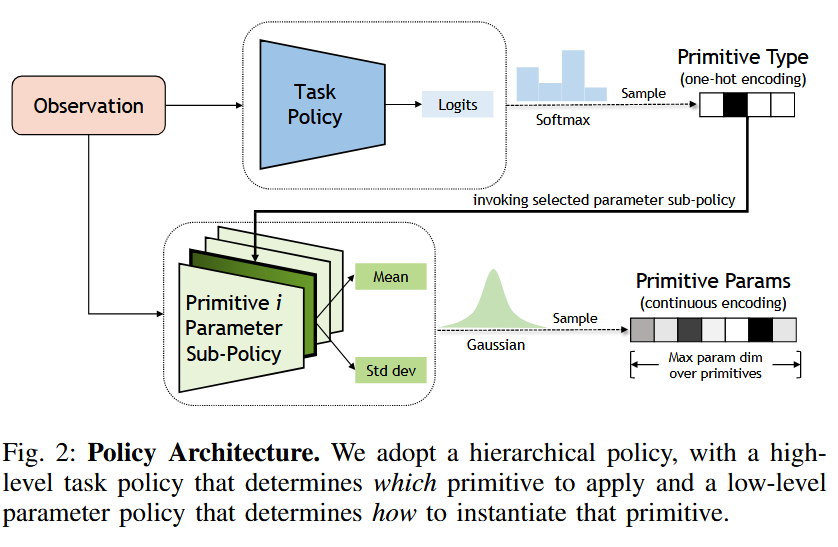
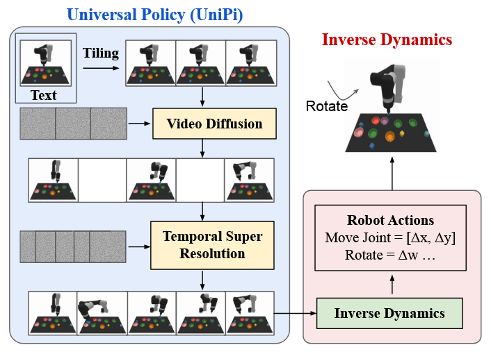
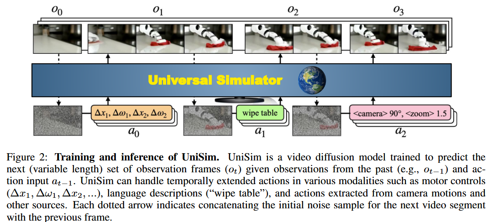

# Awesome Papers about VLM for Embodiment Task

A curated list of influential papers about VLM for embodiment task which is maintained by [Wananci](https://github.com/Wananci). 

## Table of Contents
- [Introduction](#introduction)
- [🤖Reinforcement Learning](#reinforcement-learning)
  - [Primitive Skill](#primitive-skill)
- [👀Vision Language Action Model](#vision-language-action-model)

# Introduction

Embodied agents are AI-driven systems designed to interact with the physical or virtual world through a body or avatar, enabling perception, action, and communication. These agents combine sensory inputs (e.g., vision, speech) with cognitive processes to perform tasks, simulate human-like behaviors, or engage in immersive interactions. They are widely used in robotics, virtual assistants, and gaming for more natural and context-aware interactions.

# 🤖 Reinforcement-Learning

# Primitive Skill
- [**Soft Actor-Critic: Off-Policy Maximum Entropy Deep Reinforcement Learning with a Stochastic Actor**](http://arxiv.org/abs/1801.01290) [**arXiv 2018.08**] [[**Code**]](https://github.com/haarnoja/sac)

  

    
🔍 <b>Highlight</b>

    <em>"Our method instead combines off-policy actorcritic training with a stochastic actor, and further aims to maximize the entropy of this actor with an entropy maximization objective."</em>  

    - **Maximum Entropy**
    - **Stochastic Actor**

  

  **Authors**: Tuomas Haarnoja1, Aurick Zhou1, Pieter Abbeel1, Sergey Levine1  
  1University of California, Berkeley  

- [**Augmenting Reinforcement Learning with Behavior Primitives for Diverse Manipulation Tasks**](http://arxiv.org/abs/2110.03655) [**arXiv 2022.06**] [[**Code**]](https://ut-austin-rpl.github.io/maple)

  

    
🔍 <b>Highlight</b>

    - **Hierarchical Policy: high-level for primitive and low-level for parameters** 
    - **Agent tends to use high-level primitive rather than atomic action**
    - **Exploration with Affordances**

    
  

  **Authors**: Soroush Nasiriany1, Huihan Liu1, Yuke Zhu1  
  1The University of Texas at Austin  

- [**Primitive Skill-based Robot Learning from Human Evaluative Feedback**](http://arxiv.org/abs/2307.15801) [**arXiv 2023.07**] [[**Code**]](https://seediros23.github.io/)

  

    
🔍 <b>Highlight</b>

    - **Human Evaluation** 
    - **Primitive Skill**
    - **Parameter Policy**

    
  

  **Authors**: Ayano Hiranaka*1, Minjune Hwang*2, Sharon Lee2, Chen Wang2, Li Fei-Fei2, Jiajun Wu2, Ruohan Zhang2  
  1Department of Mechanical Engineering, Stanford University  
  2Department of Computer Science, Stanford University  

# 👀 Vision Language Action Model

# World Model
- [**Learning Universal Policies via Text-Guided Video Generation**](http://arxiv.org/abs/2302.00111) [**arXiv 2023.11**] [[**Code**]](https://universal-policy.github.io/)
  
  

    
🔍 <b>Highlight</b>

    - **Diffusion model - Tiling** 
    - **Coarse-to-fine generate video**

    
  

  **Authors**: Yilun Du*†‡, Mengjiao Yang*‡§, Bo Dai‡¶, Hanjun Dai‡¶, Ofir Nachum‡, Joshua B. Tenenbaum†, Dale Schuurmans‡‖, Pieter Abbeel§  
  †MIT  
  ‡Google DeepMind  
  §UC Berkeley  
  ¶Georgia Tech  
  ‖University of Alberta

- [**Learning Interactive Real-World Simulators**](http://arxiv.org/abs/2310.06114) [**arXiv 2024.09**] [[**Code**]](https://universal-simulator.github.io)

  

    
🔍 <b>Highlight</b>

    - **Multi-source data**  
    - **Diffusion model**
    - **Generate video through past observation and input action**   
  
    
  

  **Authors**: Sherry Yang1,2, Yilun Du3, Seyed Kamyar Seyed Ghasemipour2, Jonathan Tompson2, Leslie Kaelbling3, Dale Schuurmans2,4, Pieter Abbeel1  
  1UC Berkeley  
  2Google DeepMind  
  3MIT  
  4University of Alberta  

- [**Predictive Inverse Dynamics Models are Scalable Learners for Robotic Manipulation**](http://arxiv.org/abs/2412.15109) [**arXiv 2024.12**] [[**Code**]](https://nimolty.github.io/Seer/)

  

    
🔍 <b>Highlight</b>

    - **End-to-End model**  
    - **Unidirectional Attention Mask**  
    - **Predict future image and action**  

    
  

  **Authors**: Yang Tian1,4,*, Sizhe Yang6,1,*, Jia Zeng1, Ping Wang3,4,5, Dahua Lin6, Hao Dong2, Jiangmiao Pang1,†  
  1Shanghai AI Laboratory  
  2CFCS, School of CS, Peking University  
  3National Engineering Research Center for Software Engineering, Peking University  
  4School of Software & Microelectronics, Peking University  
  5Key Laboratory of High Confidence Software Technologies (PKU), Ministry of Education  
  6Chinese University of Hong Kong
