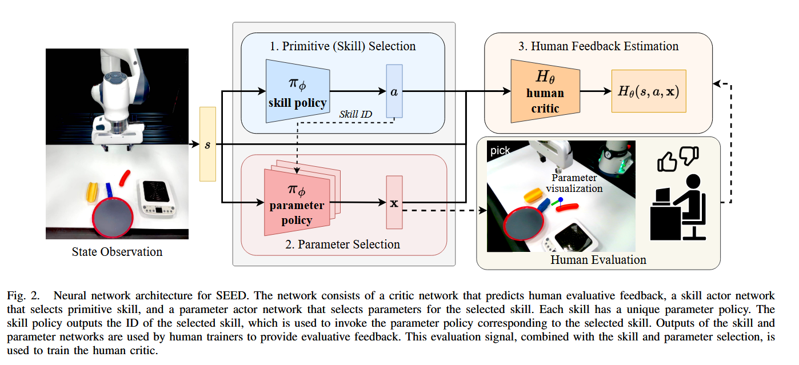

# Awesome Papers about VLM for Embodiment Task

A curated list of influential papers about VLM for embodiment task which is maintained by [Wananci](https://github.com/Wananci). 

## Table of Contents
- [Introduction](#introduction)
- [Primitive Skill](#primitive-skill)

# Introduction

Embodied agents are AI-driven systems designed to interact with the physical or virtual world through a body or avatar, enabling perception, action, and communication. These agents combine sensory inputs (e.g., vision, speech) with cognitive processes to perform tasks, simulate human-like behaviors, or engage in immersive interactions. They are widely used in robotics, virtual assistants, and gaming for more natural and context-aware interactions.

# 🚀 Primitive Skill
- [**Soft Actor-Critic: Off-Policy Maximum Entropy Deep Reinforcement Learning with a Stochastic Actor**](http://arxiv.org/abs/1801.01290) [**arXiv 2018.08**] [[**Code**]](https://github.com/haarnoja/sac)

  

    
🔍 <b>Highlight</b>

    <em>"Our method instead combines off-policy actorcritic training with a stochastic actor, and further aims to maximize the entropy of this actor with an entropy maximization objective."</em>  

    - **Maximum Entropy**
    - **Stochastic Actor**

  

  **Authors**: Tuomas Haarnoja1, Aurick Zhou1, Pieter Abbeel1, Sergey Levine1  
  1University of California, Berkeley  

- [**Augmenting Reinforcement Learning with Behavior Primitives for Diverse Manipulation Tasks**](http://arxiv.org/abs/XXXX.XXXXX) [**arXiv 20XX.XX**] [[**Code**]](https://github.com/example/repo)

  

    
🔍 <b>Highlight</b>

    - **Reinforcement Learning** 
    - **Behavior Primitives**
    - **Manipulation Tasks**

    
  

  **Authors**: Soroush Nasiriany1, Huihan Liu1, Yuke Zhu1  
  1University of [Institution Name]  

- [**Primitive Skill-based Robot Learning from Human Evaluative Feedback**](http://arxiv.org/abs/2307.15801) [**arXiv 2023.07**] [[**Code**]](https://seediros23.github.io/)

  

    
🔍 <b>Highlight</b>

    - **Human Evaluation** 
    - **Primitive Skill**
    - **Parameter Policy**

    
  

  **Authors**: Ayano Hiranaka*1, Minjune Hwang*2, Sharon Lee2, Chen Wang2, Li Fei-Fei2, Jiajun Wu2, Ruohan Zhang2  
  1Department of Mechanical Engineering, Stanford University  
  2Department of Computer Science, Stanford University  

